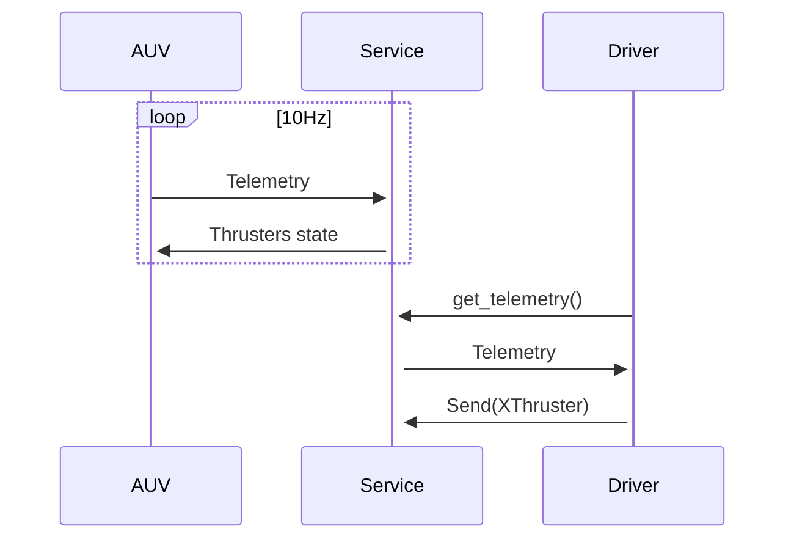

# Driver
Implementation for communication protocol of auv

### sequence diagram


## Example
```python
from msur_packages.driver.protocol import XThrust
from msur_packages.driver.service import Client

# Create client
c = Client()

# Getting telemetry from msur-service
print(c.telemetry())
# Send X Thrust with 30% value
c.send([XThrust(value=30)])

```